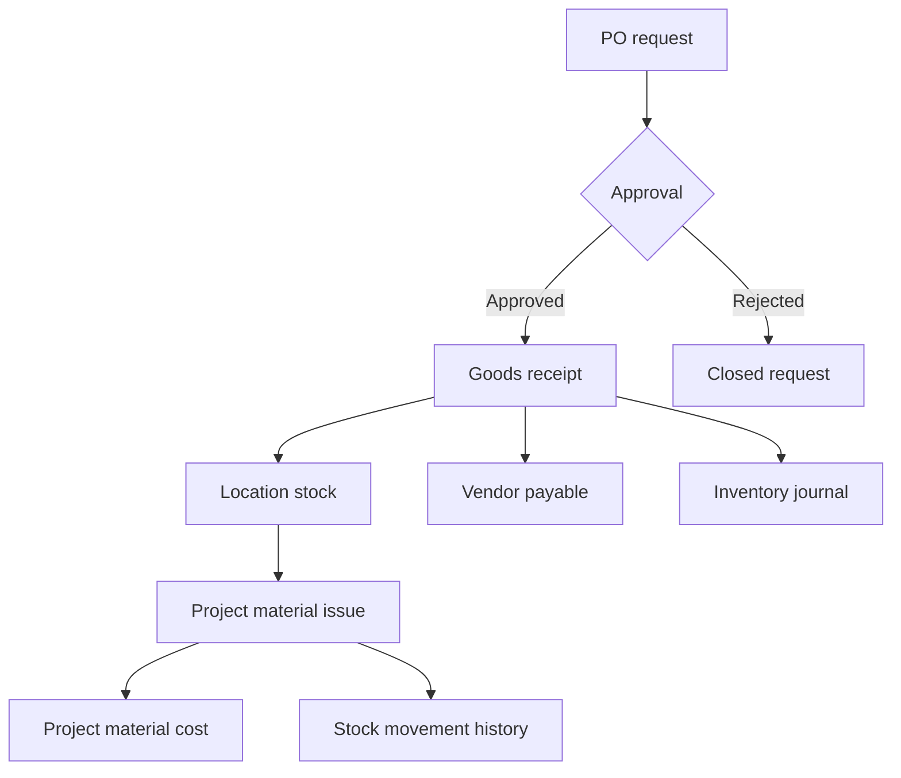
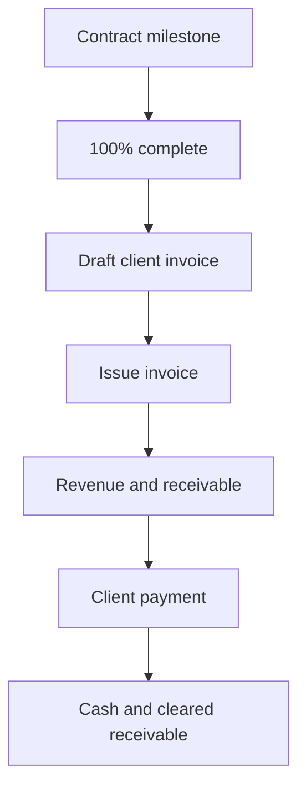
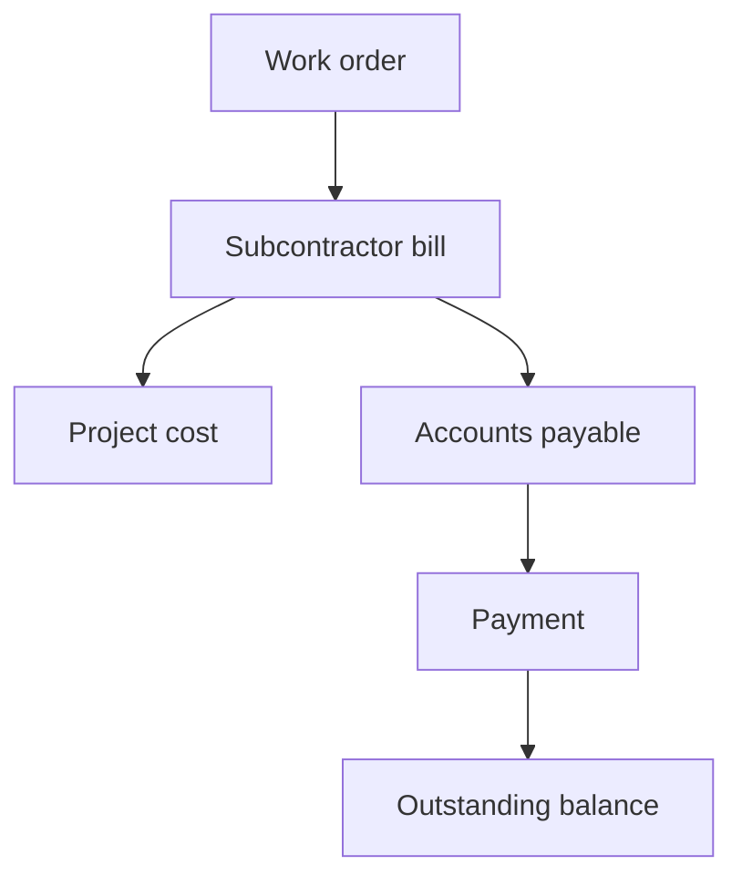

# Architecture

## Tenant boundary

`Organization` is the tenant root. Shared users join organizations through `Membership`, which carries the organization role. Tenant-owned domain records use a required `organizationId` even when that value could be inferred through another relation. The duplication is deliberate: it keeps authorization queries explicit and makes future partitioning, audit and RLS policies straightforward.

All server mutations follow the same boundary:

1. Resolve Auth.js session.
2. Read `organizationId`, `membershipId` and `role` from the signed session.
3. Check a named permission.
4. Re-fetch every target record with `id + organizationId`.
5. Apply connected writes in one database transaction.

Site Engineer project reads additionally require a `ProjectMember` match.

## Connected transaction chains

### Procurement and inventory



### Milestone revenue



### Subcontractor cost



## Accounting

Operational modules are the source of truth; accounting entries are generated in the same Prisma transaction. System accounts use stable codes. Every journal validates that debits equal credits before creation.

Project P&L uses issued client invoices as revenue and material consumption, subcontractor bills, allocated payroll and direct expenses as cost. Stock purchases remain an asset until material is issued to a project.

## Inventory valuation

Phase 1 uses weighted-average cost:

```text
new average cost =
  (existing quantity × existing average + received quantity × receipt cost)
  ÷ new total quantity
```

Transfers do not change organization value. Issues reduce inventory and post material cost. Adjustments preserve an auditable reason and accounting entry.

## Extension boundaries

The universal core is Auth, Organization, Membership, People, Finance, Landing and Leads. Construction is an industry pack registered in `lib/modules.ts`. Future modules must continue using the same organization boundary and should add optional project relations when the record is project-specific.

- Equipment: `organizationId`, optional `projectId`, custody, maintenance and depreciation
- Safety: `organizationId`, required `projectId`, incident workflow and evidence
- BOQ: `organizationId`, `projectId`, immutable revisions and item links
- Tenders: `organizationId`, `projectId`, work package and bidder/subcontractor links
- Client portal: organization/project-scoped external identity and visibility grants
